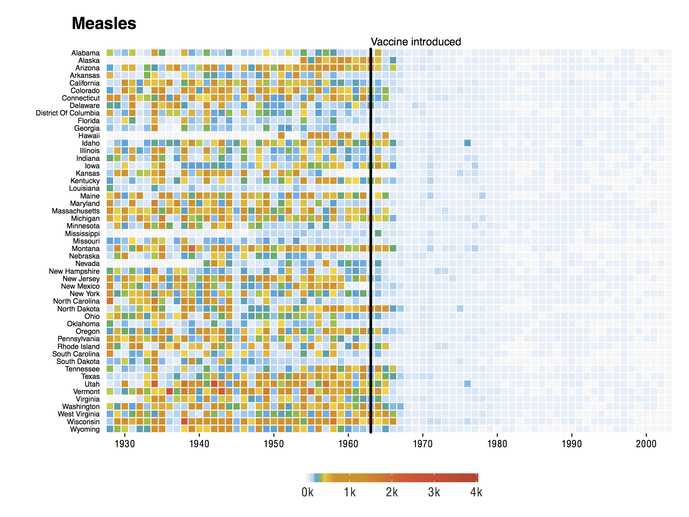
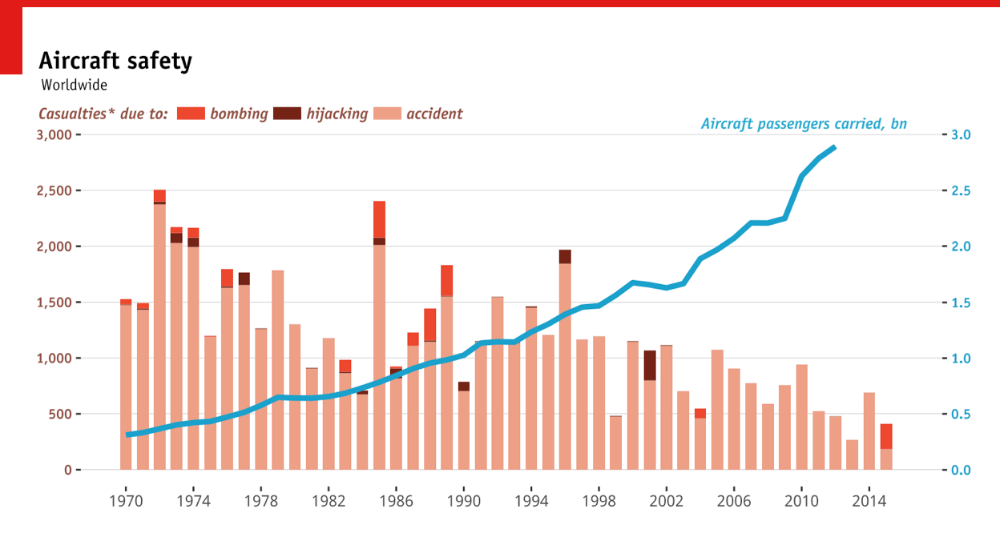
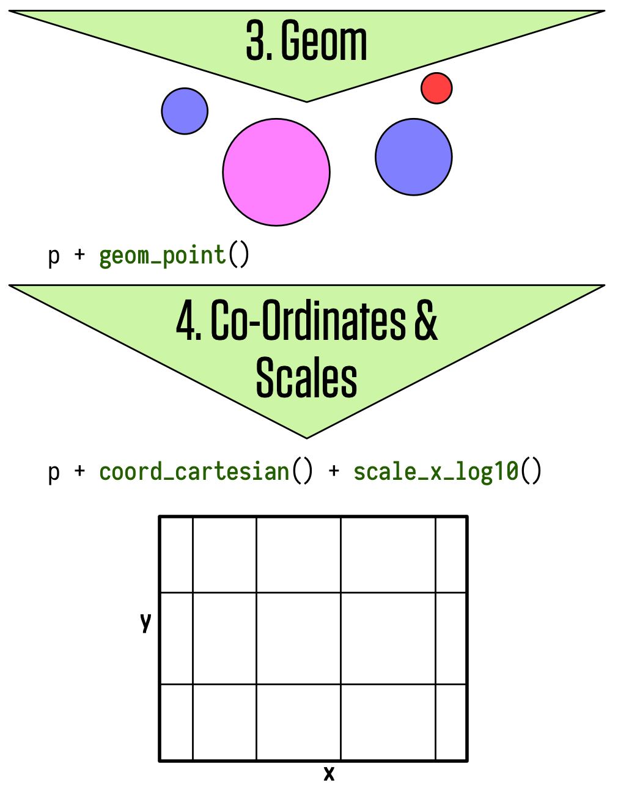

```{r setup, include=FALSE}
knitr::opts_chunk$set(echo = TRUE)
```

```{r,message=FALSE, echo=FALSE}
library(hrbrthemes)
library(tidyverse)
library(Cairo)

extrafont::loadfonts()
```


# Introductions

## About myself

- Data Scientist at Looping Studios in Berlin
- Postdoc at Hertie from May 2015 to Dec 2017
- PhD in PolSci (Uni Mannheim)
- Research on parties, legislative politics, electoral behavior
- Authored several journal articles and book chapters
- Programming with R since 2011 (switched from STATA)

**Contact**:

- <a href="mailto:mh@looping.group"><i class="fa fa-envelope"></i> mh@looping.group</a>

## About yourself
- Who are you?
- Why did you take this workshop?
- What are your expectations?


## Plan for Today

10:00 - 11:45 Session 1: Elements and Style of a Quantitative Paper

11:45 - 12:15 Lunch break

12:15 - 14:00 Session 2: The Principles of Scientific Visualizations

14:15 - 16:00 Session 3: Visualizing Data and Results with R

Slides and additional content are on [Moodle](https://moodle.hertie-school.org/mod/book/view.php?id=43506&chapterid=1181
) and [GitHub]()

## Things we (unfortunately) can't cover

- Research design
- How to get, process, and analyze data
- Help with STATA

##  {.standout}
Session 1: Elements and Style of a Quantitative Paper

# Elements of a research paper

## Structure of a quantitative research paper

Whose mind are you going to change about what?

1. Abstract
2. Introduction 

    + motivation, state of the art, results, contribution
3. Theory and hypotheses
4. Research Design
5. \alert{Data and Methods}
6. \alert {Results}
7. Discussion and Conclusion  
8. References
9. Appendix

## Content and structure of a Method Section

1. Intention and Goal of the Analysis

2. Description and Justification of the Data Selection

3. Description and Operationalization of the Dependent and Independent Variables

    + descriptive statistics, distribution, etc.

4. Description of the Methodology

5. Presentation of the Results
 
6. Discussion of the Results

    + including robustness checks


## Things to remember about Style ([King 2006](https://gking.harvard.edu/files/paperspub.pdf))

> "The best way to understand how to organize a paper is to imagine that your readers will randomly fall asleep at any time for five minutes and yet keep turning pages; when they wake up, they should know exactly where they are from your subheadings alone."

- Your paper should be rigorously structured and organized into sections and subsections

- Heading titles should be clear, contain no acronyms, and should summarize the key point in the section

- You are writing for busy people looking for a way to finish the thankless task of reviewing your paper as quickly as possible

- You need to make reading your paper as easy as possible

## Things to remember about Style ([King 2006](https://gking.harvard.edu/files/paperspub.pdf))

- The overall structure of the paper, and all the key points you want to make, should make sense in terms of accomplishing _your_ goal

-  Keep revising the list of section headings until it looks like a table of contents that conveys your key point well even if one does not read the paper

- Do not try to hide weaknesses in your paper. Be so forthright with potential problems

## Math

- Write down your statistical model and likelihood function 
- Use only as many decimal places as you have precision

- Mathematics is always in italics and Greek letters

- e.g. not yhat = beta-b + gamma-w *X + e but $\widehat{\gamma_i} = \beta^b + \gamma^wX_i + \epsilon_i$ 

- Larger equations should be set with equation numbers, and be referred to as with this example of Bayes Theorem:

\begin{align}
P(\theta|\gamma) = \frac{P(\gamma|\theta)P(\theta)}{P(\gamma)},
\end{align}

where $\theta$ is an unknown parameter and $\gamma$ is a data vector.

## Language

- Do not say that quantities are "statistically significant" unless you have a very good substantive reason to do so

- Avoid saying "this proves that". You are not a physicist!

- Focus the discussion on the direction and substantive effect of your key predictors

- Use active ("We ran a least squares regression.") rather than passive ("A least squares regression was run.")

## Tables and Figures

- Tables and figures should be included to make specific points, and to draw readers' attention to these points

- All tables and figures should be fully documented

- In most cases, a figure is better than a table

- Number the figures and tables (separately) consecutively

- Refer to each in the text by number (e.g., see Figure 4)

- When explaining the content of a figure, it is good practice to devote one paragraph to the setup—the horizontal and vertical axis measurements, the unit of analysis, etc.—and then to start a new paragraph that explains your results

## Describing your Analysis

- Provide sufficient information about your analysis so that it is possible for
someone who reads your paper to replicate the analysis. 

- Be very precise about coding rules, where the data came from, how indices were computed, what the unit of analysis is, etc

## Final Thought

Find a publication in a top 3 academic journal and model your paper after it!

##  {.standout}
Session 2: The Principles of Scientific Visualizations

# The Purpose of Graphics

## Why Visualization is Important

> "At their best, graphics are instruments for reasoning about quantitative information."
[Tufte (1983)](https://books.google.de/books/about/The_Visual_Display_of_Quantitative_Infor.html?id=BHazAAAAIAAJ&redir_esc=y)

> "There is no statistical tool that is as powerful as a well-chosen graph."
[Chambers et al. (1983)](https://books.google.de/books/about/Graphical_methods_for_data_analysis.html?id=I-tQAAAAMAAJ)

> "Diagrams prove nothing, but bring outstanding features readily to the eye."
[Fisher (1925)](https://books.google.de/books/about/Statistical_Methods_For_Research_Workers.html?id=4bTttAJR5kEC&redir_esc=y)

> "Graphics should report the results of careful data analysis—rather than be an
attempt to replace it." [Tukey (1993)](https://www.jstor.org/stable/1390951?seq=1#page_scan_tab_contents)

## Graphics are used to communicate discoveries

- Discovery goals:

    + Giving an overview—a qualitative sense of what is in a dataset
    + Conveying the sense of the scale and complexity of a dataset

- Communication goals:

    + Communication to self and others: Displaying information from the dataset in a readily understandable way
    + Telling a story
    + Attracting attention and stimulating interest

## Interpreting a graph depends on expectations

- If readers have a lot of background knowledge, they will view the graphic differently 
don't assume you already have the reader’s interest and involvement 
- Making graphics attractive can help motivate readers to understand them

## Graphics are part of a story

- A graphic does not live on its own
- There can be annotations, a legend, a title, a caption, accompanying text, an overall story, and a headline

## Seven Rules for Better Figures ([Rougier et al. 2014](http://journals.plos.org/ploscompbiol/article?id=10.1371/journal.pcbi.1003833))

1. Know your audience

    + Who is the figure for?
2. Identify your message

    + What is the role of the figure?
3. Captions are not optional

    + Always use captions, explaining how to read a figure
4. Use color effectively

    + Color can be your greatest ally or your worst enemy ([Tufte 1983](https://books.google.de/books/about/The_Visual_Display_of_Quantitative_Infor.html?id=BHazAAAAIAAJ&redir_esc=y))
    
## Seven Rules for Better Figures ([Rougier et al. 2014](http://journals.plos.org/ploscompbiol/article?id=10.1371/journal.pcbi.1003833))

5. Do not mislead the reader

    + A scientific figure is tied to the data
6. Avoid chartjunk

    + Get rid of any unnecessary non-data-ink
7. Get the right tool

    + Use R!


##  {.standout}
Session 3: Visualizing Data and Results with R

# Initial Set-Up

## Install Packages

\footnotesize

```{r, eval = FALSE}
my_packages <- c("tidyverse", "broom", "gapminder",
                 "hrbrthemes", "margins", "MASS", 
                 "scales", "stargazer", "survival")
install.packages(my_packages, repos = "http://cran.rstudio.com")
```

\normalsize

## Load Packages

```{r, message=FALSE}
library(tidyverse) # Core data science package
library(broom) # Tidy Model output
library(extrafont) # Custom fonts package
loadfonts() # Register custom fonts
library(gapminder) # Example GDP dataset
library(hrbrthemes) # Custom theme package
theme_set(theme_ipsum()) # Enable custom theme
library(margins) # Compute marginal effects
library(MASS) # Statistical models package
library(scales) # Adjust scales
library(stargazer) # Produce beautiful tables
library(survival) # For survival models
```

## Why use R?

- Open source: makes it highly customizable and easily extensible
- Over 7,500 packages and counting
- Used by many social scientists interested in data analysis
- Powerful tool to generate elegant and effective plots
- Command-line interface and scripts favors reproducibility
- Excellent documentation and online help resources

## ggplot2

R has several systems for making graphs, but `ggplot2` is one of the most elegant and most versatile. `ggplot2` implements the grammar of graphics, a coherent system for describing and building graphs.

## ggplot2 examples

```{r, out.width = "300px", echo = F, fig.align='center'}
knitr::include_graphics("img/weather.png")
```  

[Source](http://rpubs.com/bradleyboehmke/weather_graphic)

## ggplot2 examples

```{r, out.width = "300px", echo = F, fig.align='center'}

```  

[Source](https://benjaminlmoore.wordpress.com/2015/04/09/recreating-the-vaccination-heatmaps-in-r/)

## ggplot2 examples

```{r, out.width = "300px", echo = F, fig.align='center'}

``` 

[Source](https://www.quora.com/What-is-the-most-elegant-plot-you-have-made-using-ggplot2-in-R-Embed-the-code-if-possible)

## ggplot2 examples

```{r, out.width = "300px", echo = F, fig.align='center'}
knitr::include_graphics("img/map.png")
``` 

[Source](https://github.com/hrbrmstr/ggcounty)

## The grammar of graphics
- Each plot is made of layers. Layers include the coordinate system (x-y), points, labels, etc.
- Each layer has aesthetics (`aes`) including x & y, size, shape, and color.
- The main layer types are called geometrics(`geom`) and include
lines, points, etc.

## The grammar of graphics

A `ggplot` is build piece by piece

```{r, out.width = "300px", echo = F, fig.align='center'}
knitr::include_graphics("img/ggplot1.png")
``` 

[Source](http://socviz.co/make-a-plot.html#make-a-plot)

## The grammar of graphics

```{r, out.width = "300px", echo = F, fig.align='center'}

``` 

## The grammar of graphics

```{r, out.width = "300px", echo = F, fig.align='center'}
knitr::include_graphics("img/ggplot3.png")
``` 

## ggplot workflow

1. Tell the `ggplot()` function what your data are.

2. Tell `ggplot` what relationships we want to see.

3. Tell `ggplot` how you want to see the relationships in your data.

4. Add additional layers to the p object one at a time.

5. Use additional functions to adjust scales, labels, tick marks.

## Components of a ggplot2 graph

- \alert{data:} Variables mapped to aesthetic attributes
- \alert{aesthetic}: Visual property of the plot objects
- \alert{geom:} Geometrical object used to represent data
- \alert{stats:} Statistical transformations of the data
- \alert{scales:} Values mapped to aesthetic attributes
- \alert{coord:} Coordinate system
- \alert{facets:} Subplots that each display one subset of the data

## Tidy data

`ggplot` requires data to be \alert{tidy}, with observations in rows and variables grouped in _key_ | _value_ columns. 

| Person       |  treatmentA | treatmentB |
| ------------ | ----------- | ---------- |
| John Smith   |             | 2          |
| Jane Doe     | 16          | 11         |

| Person       |  treatment  | result     |
| ------------ | ----------- | ---------- |
| John Smith   | a           |            |
| Jane Doe     | a           | 16         |
| John Smith   | b           | 2          |
| Jane Doe     | b           | 11         |


# Plotting Distributions

## Variation

- Variation is the difference between expected output to observed output.

- Visualization of the distribution is different for categorical (`fctr`, `chr`) and continuous (`dbl`, `ìnt`, `dttm`) variables

## Distributions of categorical data

```{r, dev="cairo_pdf", fig.width=8, fig.height=4}
ggplot(data=diamonds) +
  geom_bar(mapping = aes(x = cut))
```

## Distributions of continuous data

```{r, dev="cairo_pdf", fig.height=4}
ggplot(data=diamonds) +
  geom_histogram(mapping = aes(x = carat), 
                 binwidth = 0.5)
```

## Boxplot

We can use `geom_boxplot()` to plot covariation between continuous and catagorical variables

```{r, dev="cairo_pdf", fig.height = 4}
ggplot(data = mpg, aes(x = class, y = hwy, fill = class)) +
  geom_boxplot(aes(x=reorder(class, hwy,FUN = median), 
                   y = hwy)) +
  theme(legend.position = "none")
```

## Tile Plot

We can use `geom_tile` to plot the covariation between two categorical variables

```{r, dev="cairo_pdf", fig.height=4}
diamonds %>% 
  count(color, cut) %>%  
  ggplot(mapping = aes(x = color, y = cut)) +
    geom_tile(mapping = aes(fill = n))
```

## Scatter Plots

The easiest way to visualize the covariation between two continuous variables is to draw a scatterplot with `geom_point()`.

```{r, fig.height=4}
p <- ggplot(data=gapminder, mapping = aes(x = gdpPercap, 
                                          y = lifeExp)) +
  geom_point() +
  scale_x_log10(labels = scales::dollar) +
  labs(x = "GDP Per Capita",
       y = "Life Expectancy in Years",
       title = "Economic Growth and Life Expectancy",
       subtitle = "Data points are country-years",
       caption = "Source: Gapminder.")
```

## Scatter Plots

```{r, dev="cairo_pdf", echo=FALSE}
p
```

# Presenting model-based graphics

## Goals

1. Show how `ggplot` can use various modeling techniques directly within geoms
2. Tidily extract and plot estimates of models that we fit ourselves

## OLS vs. Robust Regression

- The `geom_smooth()` function can take a range of method arguments to fit LOESS, OLS, and robust regression lines
- `geom_smooth()` can also be instructed to use different formulas to produce their fits

```{r}
p_ols <- p + geom_smooth(color = "tomato", fill="tomato", 
                         method = MASS::rlm) +
  geom_smooth(color = "steelblue", fill="steelblue",
              method = "lm")
```

## OLS vs. Robust Regression

```{r, dev="cairo_pdf", echo = FALSE}
p_ols
```

## Polynominal fit

```{r}
p_poly <- p + geom_smooth(color = "tomato", 
                          method = "lm", size = 1.2, 
                formula = y ~ splines::bs(x, 3), 
                se = FALSE)
```

## Polynominal fit

```{r, dev="cairo_pdf", echo = FALSE}
p_poly
```

## Plot Model Output

- Figures based on statistical models face all the ordinary challenges of effective data visualization

- The more complex the model,a the trickier it becomes to convey this information effectively

## Another Look at the Gapminder Data

\footnotesize
```{r, echo=FALSE}
gapminder
```

\normalsize

## Linear Model of Life Expectancy

\footnotesize

```{r}
out <- lm(formula = lifeExp ~ gdpPercap + pop + 
            continent, data = gapminder)
summary(out)
```

\normalsize

## Present your findings in substantive terms

- Show results in context where other variables are held at sensible values (e.g. mean or median)

- For continuous variables, generate predicted values that cover some meaningful range of the distribution (e.g. 25th to the 75th percentile)

- For unordered categorical variables, predicted values might be presented with respect to the  modal category

- Use a scale that readers can easily understand, e.g. use predicted probabilities if your model reports log-odds
  
- Show confidence intervals and measures of model fit when you present your results

## Tidy Data

- we can use the `tidy` function from the `broom` packages to turn our model object into a data frame that we can plot with `ggplot` 

```{r}
out_tidy <- tidy(out, conf.int = TRUE)
```

## Export Tables to Word

To export tables to Word, follow these general steps:

1. Create a table or data.frame in R.

2. Write this table to a comma-separated .txt file using write.table().

3. Copy and paste the content of the .txt file into Word.

4. In Word,

    + select the text you just pasted from the .txt file
    + go to Table → Convert → Convert Text to Table…
    + make sure “Commas” is selected under “Separate text at”, click OK

## Export Tables to Word

```{r}
write.table(out_tidy, file = "model_out.txt", 
            sep = ";", quote = FALSE,
            row.names = FALSE)
```

## Export with Stargazer

```{r, eval = FALSE}
stargazer(out, align = TRUE) # Latex
stargazer(out, type = "text", align = TRUE) # Word
```

## Coefficient Plot

```{r}
p <- ggplot(out_tidy, mapping = aes(x = term,
                                    y = estimate,
                                    ymin = conf.low, 
                                    ymax = conf.high)) +
  geom_pointrange() +
  coord_flip() +
  labs(x="", y="OLS Estimate") 
```

## Coefficient Plot

```{r, dev="cairo_pdf", echo = FALSE}
p
```

## Coefficient Plot even better

```{r}
out_tidy <- out_tidy %>% 
  mutate(term = gsub("continent", "", term))
p <- ggplot(out_tidy, mapping = aes(x = term,
                                    y = estimate,
                                    ymin = conf.low, 
                                    ymax = conf.high)) +
  geom_pointrange() +
  coord_flip() +
  labs(x="", y="OLS Estimate") 
```

## Coefficient Plot even better

```{r, dev="cairo_pdf", echo = FALSE}
p
```

## Predictions

- Use predictions to get a picture of the estimates your model produces over the range of some particular variable, holding other covariates constant at some sensible values 

- For example, predict `gdpPercap` from minimum to maximum, holding `pop` constant at its median and letting `continent` take all of its five available values 

## Prepare Data For Predictions

```{r}
min_gdp <- min(gapminder$gdpPercap)
max_gdp <- max(gapminder$gdpPercap)
med_pop <- median(gapminder$pop)

pred_df <- expand.grid(gdpPercap = 
                         (seq(from = min_gdp,
                              to = max_gdp,
                              length.out = 100)),
                       pop = med_pop,
                       continent = c("Africa", 
                                     "Americas",
                                     "Asia", "Europe", 
                                     "Oceania"))
```

## Generate Predictions

- we can use `predict()` withmour new data and model to calculate the fitted values for every row in the data frame and merge the results with `pred_df`

```{r}
pred_out <- predict(object = out,
                    newdata = pred_df,
                    interval = "predict") # 95% CI
pred_full <- cbind(pred_df, pred_out)
```

## Plot Predictions For Europe and Africa

\footnotesize

```{r}
p <- ggplot(data = subset(pred_full, 
                          continent %in% c("Europe", "Africa")),
            aes(x = gdpPercap, y = fit, ymin = lwr, 
                ymax = upr,
                color = continent, fill = continent, 
                group = continent)) + 
  geom_point(data = subset(gapminder, 
                           continent %in% c("Europe", "Africa")),
               aes(x = gdpPercap, y = lifeExp,
                   color = continent),
               alpha = 0.5,
               inherit.aes = FALSE) + 
    geom_line() +
    geom_ribbon(alpha = 0.2, color = FALSE) +
    scale_x_log10(labels = scales::dollar)
```
\normalsize


## Plot Predictions For Europe and Africa

```{r, dev="cairo_pdf", echo = FALSE}
p
```

## Tidy Results from a Survival Model

```{r}
out_cph <- coxph(Surv(time, status) ~ age + sex, 
                 data = lung)
out_surv <- survfit(out_cph)
out_tidy <- tidy(out_surv)
```

## Plot Survival Model Output

```{r}
p <- ggplot(data = out_tidy, 
            mapping = aes(time, estimate)) +
  geom_line() +
  geom_ribbon(mapping = aes(ymin = conf.low, 
                            ymax = conf.high), 
              alpha = .2)
```

## Plot Survival Model Output

```{r, dev="cairo_pdf", echo = FALSE}
p
```

## Generate Marginal Effects

- Using the General Social Survey data let's fit a logistic regression on `obama`, with `age`, `polviews`, `race`, and `sex` as  predictors.

```{r, warning = FALSE}
load("gss.RData")
gss_sm$polviews_m <- relevel(gss_sm$polviews, 
                             ref = "Moderate")
out_bo <- glm(obama ~ polviews + sex*race,
              family = "binomial", data = gss_sm)
bo_m <- margins(out_bo)
bo_gg <- as.tibble(summary(bo_m)) %>% 
  mutate(factor = gsub("polviews|sex", "", factor)) %>% 
  mutate(factor = gsub("race", "Race:", factor))
```

## Plot Marginal Effects

```{r}
p <- ggplot(data = bo_gg, aes(x = reorder(factor, AME),
                              y = AME, ymin = lower, 
                              ymax = upper)) + 
  geom_hline(yintercept = 0, color = "gray80") +
  geom_pointrange() + coord_flip() +
  labs(x = NULL, y = "Average Marginal Effect") 
```

## Plot Marginal Effects
```{r, dev="cairo_pdf", echo = FALSE}
p
```

## Need Help

[ggplot Cheat Sheet](https://github.com/rstudio/cheatsheets/raw/master/data-visualization-2.1.pdf)

##  {.standout}
That's it. Thank you for your attention. 

